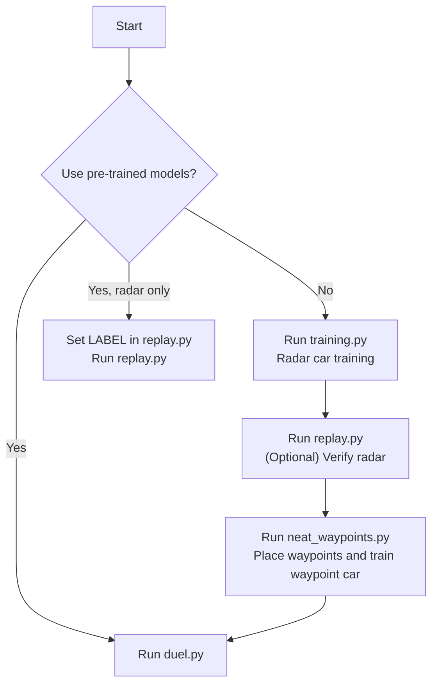

# Neuroevolutionary Agents for Autonomous Racing

This project was developed for a course in Artificial Intelligence and applies the NEAT algorithm (NeuroEvolution of Augmenting Topologies) to train autonomous controllers for a provided racing car game, built in pygame. A highly detailed report regarding project implementations and findings is available within the repository.

As a result of the quality of the report and performance of the trained agents, which achieved the fastest lap times among all submissions, the project was awarded the highest grade.

The goal is to produce two cars, racing under different controllers, that can complete the track as fast as possible while staying within bounds of the track, whilst rewarding clean cornering and faster times. Gaussian noise is applied to both sensor readings and actuator outputs to reflect real-world uncertainty and prevent overfitting to deterministic conditions. The car's physical parameters, such as maximum velocity, angular velocity, and acceleration, are fixed and cannot be modified, meaning all performance gains must come entirely from the learned control policy.

The two cars use completely different approaches to navigate the track. The purple car perceives the world through a set of distance sensors that measure how far the track walls are in several directions around it. It uses only these readings to decide how to steer and accelerate, with no prior knowledge of the track layout. The waypoint car follows a sequence of target points manually placed on the track by the user, learning to move efficiently between them.

The project specification leaves the number and placement of radar sensors entirely to the group's discretion. As such, nine sensors were chosen, arranged symmetrically around the car's heading at angles of −90°, −45°, −30°, −15°, 0°, 15°, 30°, 45° and 90°. This layout provides broad lateral coverage to detect walls on either side whilst ensuring fine angular resolution around the forward direction to input to the network early warning of upcoming curves. The tighter spacing near centre (−15° and 15°) allows the network to detect subtle changes in track direction well ahead of the car, while the wider sensors at ±45° and ±90° provide situational awareness of the surrounding walls. This combination proved more effective than the baseline five-sensor layout at producing smooth cornering behaviour without making the input space unnecessarily large.

## Requirements

Only Python 3 is required alongside four Python packages: `neat`, `pygame`, `numpy`, `matplotlib`

## Usage

The repository includes the best pre-trained performers for each car, `winner_radar.pkl` and `winner_waypoints.pkl`. Simply open `replay.py`, set the `LABEL` variable at the bottom of the file to the name of whichever run you want to replay, and run it. To observe both cars racing directly, run `duel.py` directly. The window stays open until you close it manually. Note that, as these are fine-tuned for optimal lap times, random Gaussian noise (as per project statement) will cause failed laps.

You may train the radar car by running `training.py`. A population of cars attempts to drive the track, the best performers are kept, and the process repeats over many generations until a capable driver emerges. The trained model is saved automatically to the `models` folder. You can then run `replay.py` to watch a saved winner drive file `.pkl` and verify its performance.

Training the waypoint car requires a separate file, `neat_waypoints.py`, which opens the track in a window. You click directly onto the track to place waypoints along the racing line you want the car to follow, then press either Space or Enter keys to begin training. The trained model and the waypoints are saved automatically to the `models` folder.

Other code files available within the project are simply leftovers from prior implementations.

## Limitations

Reverse Track testing was not pursued due to redundancy and time constraints.
